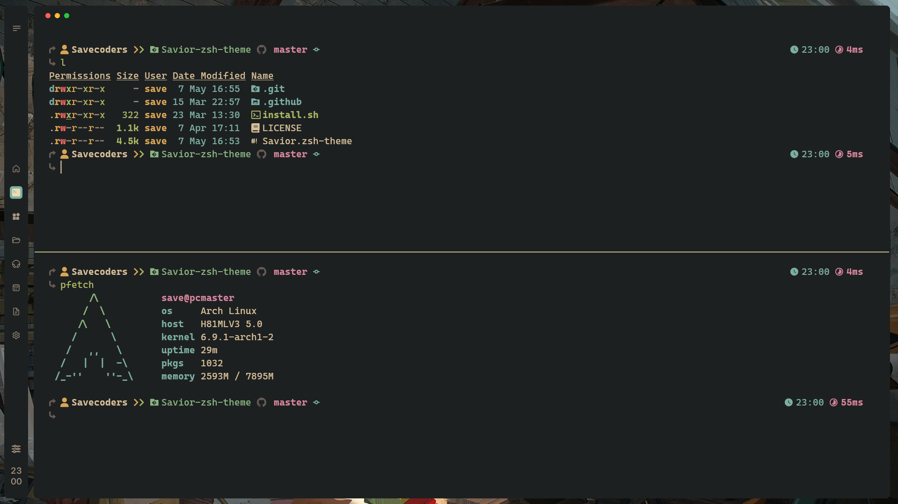
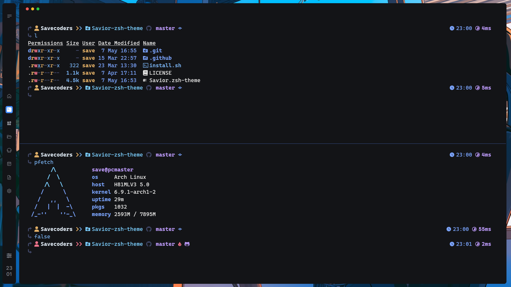
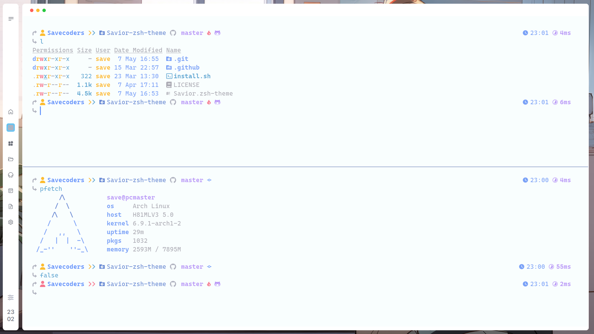

<p align="center">
  
</p>
<!-- BADGES -->
<h1>
  <a href="#">
    
  </a>
  <a href="#">
    
  </a>
</h1>

<h2 align="center" style="font-weight:mediun; padding:40px;"> 🪶 My Simple and Minimalist Zsh Theme</h2>

## 📦 Installation Manual

Recomend use the install Script

```bash
  chmod +x ./install.sh && ./install.sh
```

## 📥 Install ohmyzsh

```bash
sh -c "$(curl -fsSL https://raw.githubusercontent.com/ohmyzsh/ohmyzsh/master/tools/install.sh)"
```

> [!TIP]
> This is basic install recommended in documentation: [ohmyz](https://ohmyz.sh/#install)

## 🦽 Installation Manual

Recomend use the Script

```bash
  chmod +x ./install.sh && ./install.sh
```

```bash
  git clone https://github.com/Savecoders/Savior-zsh-theme.git
  cp -r ./Savior-zsh-theme/Savior.zsh-theme ~/.oh-my-zsh/themes/
```

> [!IMPORTANT]  
> In your `~/.zshrc` file, set `ZSH_THEME="Savior"`.

```zsh
# Path to your oh-my-zsh installation.
export ZSH="$HOME/.oh-my-zsh"

# See https://github.com/ohmyzsh/ohmyzsh/wiki/Themes
# .oh-my-zsh/themes/
ZSH_THEME="Savior"
```

## 📷 Gallery Images

This images is using my zsh-theme in kitty terminal config [Dotfiles](https://github.com/Savecoders/dotfiles)





## License

[MIT License](../LICENSE)
